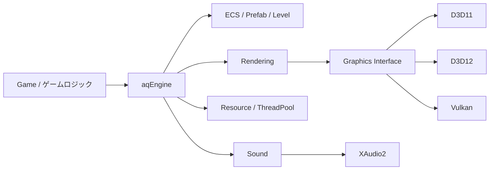

# aqEngine — C++ ゲームエンジン / 技術ポートフォリオ

> シューティングやアクションなどのゲームを作れることを目標にした、C++ 製の自作ゲームエンジンと、その上で動くゲーム。

**開発期間**: 2024 年 8 月 〜 現在（継続開発中）
**開発形態**: 個人開発

---

## 概要

`aqEngine` は、描画 API・プラットフォームに依存しないゲーム制作基盤を目指して開発している自作ゲームエンジンです。
グラフィックス・サウンド・入力（ゲームパッド）・プラットフォームといった**主要なプラットフォーム依存システムを Bridge パターンで抽象化**し、
上位レイヤー（ゲームロジック）を改修せずにバックエンドを差し替えられる設計にしています。

描画 API（DirectX11 / DirectX12 / Vulkan）の選択は、`ENGINE_GRAPHICS_*` マクロによる **ビルド時切り替え**です（既定は D3D12）。
実行時の動的切り替えではなく、ビルド構成でバックエンドを固定する方式を採っています。

エンジン本体（`aqEngine`）と、それを利用して動作するゲーム（`Game`）の 2 層構成で開発しています。
### アーキテクチャ

---

## 開発環境

| 項目 | デスクトップ（Windows） | Xbox（UWP） |
| --- | --- | --- |
| IDE | Visual Studio 2026 | Visual Studio（v142 導入） |
| プラットフォームツールセット | v145 | v142 |
| Windows SDK | 10.0.26100.0 | 10.0.22621.0（最小 10.0.19041.0） |
| 言語標準 | C++20（`stdcpp20`） | C++20（`stdcpp20`） |
| グラフィックス API | DirectX 11 / DirectX 12 / Vulkan（ビルド時に選択） | DirectX 12 |

**主な外部ライブラリ**: Bullet Physics / ufbx / Dear ImGui / XAudio2 ほか

---

## ビルドと実行

1. **必要環境**
   - デスクトップ: Visual Studio 2026（v145 ツールセット）
   - Xbox（UWP）: Visual Studio と v142 ツールセット
   - Windows SDK 10.0.26100.0（UWP は 10.0.22621.0）
   - C++20 対応
   - Vulkan バックエンドをビルドする場合のみ Vulkan SDK が別途必要
2. **ソリューション**: `DirectX.sln` を開く
3. **構成の選択**
   - デスクトップ: `Debug` / `Release`（`x64`）
   - Xbox（UWP）: `DebugXbox` / `ReleaseXbox`
4. **描画バックエンドの切り替え**
   - 既定は **D3D12**（`aqEngine/aq.h` で自動選択）
   - D3D11 / Vulkan を使う場合は、プロジェクトのプリプロセッサ定義で
     `ENGINE_GRAPHICS_D3D11` または `ENGINE_GRAPHICS_VULKAN` を明示定義する
     （複数同時定義はビルドエラーになる）
5. **実行**: `Game`（`DirectX.vcxproj`）をスタートアッププロジェクトにして起動

> ※作業ディレクトリやアセットの配置など、実行時の前提はプロジェクト設定に依存します。

---

## 実装状況

| システム | 状況 | 補足 |
| --- | --- | --- |
| D3D12 バックエンド | 実機動作確認済み | 既定バックエンド |
| D3D11 バックエンド | 実機動作確認済み | Xbox UWP の FL10 系フォールバック経路あり |
| Vulkan バックエンド | 実機描画まで確認 | 一部機能に制約あり |
| ECS（アーキタイプ方式） | 実装済み | System 並列実行対応 |
| Level システム | 実装済み | 非同期ロード / GameFlow 連携 |
| パーティクル | 実装済み | Unity 主要機能に対応（後述） |
| サウンド（XAudio2） | 実装済み | 3D サウンド / ECS 統合 |
| 物理（Bullet） | 実装済み | 型エイリアスで切替口を用意、実装は Bullet に密結合 |
| GPU 駆動カリング | D3D12 経路を実装済み | Vulkan / D3D11 など一部経路に制限あり |
| Xbox（UWP）移植 | 実機描画確認済み・継続開発中 | 機能制限へのフォールバックを実装。入力・音声を含む全機能の実機検証を継続 |

---

## 主な実装内容

### グラフィックス抽象化
- **DirectX11 / DirectX12 / Vulkan** をバックエンドとして持つ描画レイヤー（ビルド時に選択）
- ディファードレンダリング、シャドウ、ポストプロセス、カリング
- インスタンシング描画（Bullet Physics と連動した物理インスタンス対応）
- GPU 駆動カリング（クラスタカリング資産を流用した ExecuteIndirect 化）を開発中

### ECS（Entity Component System）
- アーキタイプ方式の ECS を自作
- System の並列実行に対応
- **JSON によるデータ駆動 Prefab**（コード改修なしでエンティティ定義を追加）

### Level システム
- Unreal Engine / Unity 風の **Level 管理**
- 非同期ロードに対応し、`GameFlow`（状態機械）と連携したシーン遷移

### パーティクルシステム
- **Unity ParticleSystem の主要機能に対応**（一部はサブセット・近似）
- Unity 側の[専用エクスポータ](Unity/Editor/AqParticleExporter.cs)で `.particle` 形式へ変換し、エンジンで再生
- Billboard / Mesh の両レンダラに対応（3D Start Rotation / Size、Separate Axes、UV Tiling など）
- **ufbx** による FBX メッシュ読み込み

### サウンド
- **XAudio2** バックエンド
- 3D サウンド、ECS 統合

### 物理
- **Bullet Physics** による衝突判定・剛体シミュレーション
- 型エイリアス方式で将来のバックエンド差し替え口を用意（現状の実装は Bullet に密結合）

### リソース管理
- `ResourceManager` による**非同期ロードと共有キャッシュ**
- `UnloadUnused()` / `Unload<T>()` による未使用リソースの解放

### 入力
- キーボード / マウス / ゲームパッド（XInput・WinRT）を抽象化
- **ActionMap** による入力バインディング

### マルチスレッド
- ThreadPool、RenderThread、非同期ロード、プロファイラ

### ツール / デバッグ
- **Dear ImGui** によるエディタ・デバッグ UI（Prefab / Level / サウンド編集など）

---

## 設計の特徴

- **API・プラットフォーム非依存**: Bridge パターンにより、上位レイヤーを無改修のままバックエンドを差し替え可能（描画 API はビルド時、その他は実行時に選択）
- **データ駆動**: Prefab や Level を JSON で定義し、C++ の再ビルドなしにコンテンツを追加・変更
- **オブジェクト指向とデータ指向の使い分け**: エンジン基盤はデザインパターン主体、ゲームエンティティは ECS（データ指向）で設計
- **マルチプラットフォーム対応**: Windows 版をベースに、Xbox（UWP）への移植を進行中

---

## 技術的なアピールポイント

このプロジェクトを通して、単にゲームを「作る」だけでなく、**大規模なコードベースを設計・保守し続ける力**を意識して開発しています。

- **低レベル API を直接扱える**
  DirectX11 / DirectX12 / Vulkan の 3 つを自前で実装。コマンドリスト、ディスクリプタ、リソースバリア、同期といった各 API の低レベルな差異を理解した上で、共通インターフェースへ抽象化しています。

- **大規模設計を破綻させないアーキテクチャ力**
  描画・入力・サウンド・プラットフォームを Bridge パターンで抽象化し、機能追加やバックエンド差し替えが局所的な変更で済む構造を維持。「上位レイヤーを触らずに拡張できること」を設計の軸にしています。

- **パフォーマンスを意識した実装**
  ECS のアーキタイプ方式、System の並列実行、ThreadPool / RenderThread によるマルチスレッド化、GPU 駆動カリングやインスタンシングなど、**CPU / GPU 両面のボトルネックを見据えた最適化**に取り組んでいます。

- **既存の設計を分析し、自分の設計へ落とし込む力**
  Unity の ParticleSystem 互換パーティクル（専用エクスポータ付き）や、Unreal Engine / Unity 風の Level 管理など、実績ある設計を研究し、自作エンジンの制約に合わせて再設計・実装しています。

- **開発を止めない周辺整備**
  ImGui によるインエディタツール、非同期ロード、リソースの共有キャッシュ／解放、プロファイラなど、**制作効率と安定性を支える基盤**まで自作しています。

- **ドキュメントを書きながら継続開発**
  機能ごとに設計書を残し、長期にわたる個人開発でも**設計意図を追える状態を保ちながら**開発を継続しています。

---

## 設計ドキュメント

概要設計、バックエンド詳細、仕様、移植記録を [設計書インデックス](設計書/README.md) に集約しています。

- [ゲームアプリケーションコア設計](設計書/06_ゲームアプリケーションコア設計.md)
- [レンダリング設計](設計書/01_レンダリング設計.md) / [D3D12](設計書/D3D12Backend設計.md) / [Vulkan](設計書/VulkanBackend設計.md)
- [ECS設計](設計書/04_ECS設計.md) / [Prefab設計](設計書/Prefab設計.md) / [Level設計](設計書/Level設計.md)
- [マルチスレッド設計](設計書/05_マルチスレッド設計.md) / [リソース管理設計](設計書/07_リソース管理設計.md)
- [ParticleSystem導入設計](設計書/FBX・ParticleSystem導入設計.md) / [.particle仕様](設計書/particleフォーマット仕様v1.md)
- [Sound設計](設計書/Sound設計.md) / [Audio Authoring設計](設計書/AudioAuthoring設計.md)
- [Xbox移植設計](設計書/Xbox移植設計.md) / [UWP移植変更まとめ](設計書/Xbox_UWP移植_変更まとめ.md)
